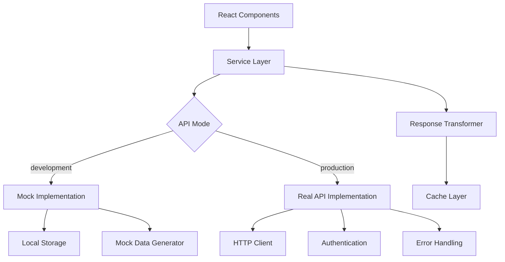

# 🔮 Tarot Timer API Interface Design

> Mock-to-Real API 전환을 위한 추상화 아키텍처 설계 명세서

## 🎯 설계 목표

**"Mock First, Real Later"** - 목업 데이터로 빠른 개발을 시작하고, 실제 API로 seamless 전환

### 핵심 원칙
1. **Interface Segregation**: Mock과 Real 구현이 동일한 인터페이스 공유
2. **Dependency Injection**: 런타임에 구현체 교체 가능
3. **Type Safety**: TypeScript로 컴파일 타임 안전성 보장
4. **Configuration Driven**: 환경 변수로 Mock/Real 전환
5. **Zero Breaking Changes**: API 전환 시 클라이언트 코드 변경 없음

---

## 🏗 아키텍처 개요



### 레이어 구조
```
├── Components (UI Layer)
├── Services (Business Logic)
├── Repositories (Data Access)
├── Data Sources (Mock | Real API)
├── Storage (Local Persistence)
└── Utils (Transformers, Validators)
```

---

## 📋 API 도메인 분석

### 1. Tarot Domain API

#### **TarotService 인터페이스**
```typescript
interface TarotService {
  // 24시간 타로 시스템
  generateDailyCards(date: string): Promise<DailyTarotReading>;
  getDailyCards(date: string): Promise<DailyTarotReading | null>;
  saveDailyMemo(date: string, hour: number, memo: string): Promise<void>;
  updateDailyInsights(date: string, insights: string): Promise<void>;
  
  // 스프레드 관리
  getSpreadTypes(): Promise<SpreadType[]>;
  createSpreadReading(spreadTypeId: string, title?: string): Promise<SpreadReading>;
  updateSpreadReading(readingId: string, updates: Partial<SpreadReading>): Promise<SpreadReading>;
  saveSpreadReading(reading: SpreadReading): Promise<string>;
  getSpreadReading(readingId: string): Promise<SpreadReading | null>;
  deleteSpreadReading(readingId: string): Promise<void>;
  
  // 카드 관리
  getAllCards(): Promise<TarotCard[]>;
  getCardById(cardId: string): Promise<TarotCard | null>;
  getCardsByIds(cardIds: string[]): Promise<TarotCard[]>;
  searchCards(query: string): Promise<TarotCard[]>;
}
```

### 2. User Domain API

#### **UserService 인터페이스**
```typescript
interface UserService {
  // 사용자 프로필
  getCurrentUser(): Promise<User | null>;
  updateProfile(updates: Partial<UserProfile>): Promise<UserProfile>;
  
  // 프리미엄 멤버십
  getPremiumStatus(): Promise<PremiumStatus>;
  subscribeToPremium(planId: string): Promise<SubscriptionResult>;
  cancelPremium(): Promise<void>;
  
  // 사용자 통계
  getUserStatistics(): Promise<UserStatistics>;
  updateReadingStreak(): Promise<number>;
}
```

### 3. Journal Domain API

#### **JournalService 인터페이스**
```typescript
interface JournalService {
  // 저널 엔트리
  getJournalEntries(options?: JournalQueryOptions): Promise<PaginatedResponse<JournalEntry>>;
  createJournalEntry(entry: CreateJournalEntryRequest): Promise<JournalEntry>;
  updateJournalEntry(entryId: string, updates: Partial<JournalEntry>): Promise<JournalEntry>;
  deleteJournalEntry(entryId: string): Promise<void>;
  
  // 저장된 스프레드
  getSavedSpreads(options?: SavedSpreadQueryOptions): Promise<PaginatedResponse<SavedSpread>>;
  archiveSpread(spreadId: string): Promise<void>;
  restoreSpread(spreadId: string): Promise<void>;
  
  // 검색 및 필터링
  searchJournalEntries(query: string): Promise<JournalEntry[]>;
  getEntriesByDateRange(startDate: string, endDate: string): Promise<JournalEntry[]>;
  getEntriesByTags(tags: string[]): Promise<JournalEntry[]>;
}
```

### 4. Settings Domain API

#### **SettingsService 인터페이스**
```typescript
interface SettingsService {
  // 앱 설정
  getSettings(): Promise<AppSettings>;
  updateSettings(updates: Partial<AppSettings>): Promise<AppSettings>;
  resetSettings(): Promise<AppSettings>;
  
  // 알림 설정
  getNotificationSettings(): Promise<NotificationSettings>;
  updateNotificationSettings(settings: NotificationSettings): Promise<void>;
  
  // 언어 및 지역화
  getSupportedLanguages(): Promise<SupportedLanguage[]>;
  updateLanguage(language: SupportedLanguage): Promise<void>;
  
  // 데이터 관리
  exportUserData(): Promise<UserDataExport>;
  importUserData(data: UserDataImport): Promise<ImportResult>;
  clearAllData(): Promise<void>;
}
```

---

## 🔧 구현 전략

### 1. Service Factory Pattern

```typescript
// src/services/ServiceFactory.ts
export class ServiceFactory {
  private static instance: ServiceFactory;
  private services: Map<string, any> = new Map();
  
  static getInstance(): ServiceFactory {
    if (!ServiceFactory.instance) {
      ServiceFactory.instance = new ServiceFactory();
    }
    return ServiceFactory.instance;
  }
  
  registerService<T>(name: string, implementation: T): void {
    this.services.set(name, implementation);
  }
  
  getService<T>(name: string): T {
    const service = this.services.get(name);
    if (!service) {
      throw new Error(`Service ${name} not found`);
    }
    return service as T;
  }
}

// Usage
const factory = ServiceFactory.getInstance();
factory.registerService('tarot', 
  __DEV__ ? new MockTarotService() : new RealTarotService()
);

const tarotService = factory.getService<TarotService>('tarot');
```

### 2. Configuration-Based Switching

```typescript
// src/config/apiConfig.ts
export const API_CONFIG = {
  mode: process.env.EXPO_PUBLIC_API_MODE || (__DEV__ ? 'mock' : 'real'),
  baseUrl: process.env.EXPO_PUBLIC_API_URL || 'https://api.tarrottimer.app',
  timeout: 10000,
  retries: 3,
  cacheTTL: 5 * 60 * 1000, // 5분
} as const;

export const isMockMode = () => API_CONFIG.mode === 'mock';
export const isRealMode = () => API_CONFIG.mode === 'real';
```

### 3. Mock Implementation Strategy

```typescript
// src/services/mock/MockTarotService.ts
export class MockTarotService implements TarotService {
  private storage = new MockStorage();
  private dataGenerator = new MockDataGenerator();
  
  async generateDailyCards(date: string): Promise<DailyTarotReading> {
    // 시뮬레이션 지연
    await this.simulateNetworkDelay();
    
    // 일관된 시드 기반 생성
    const cards = this.dataGenerator.generateDailyCards(date);
    const reading: DailyTarotReading = {
      id: `daily-${date}`,
      date,
      hourlyCards: cards,
      currentHour: new Date().getHours(),
      memos: {},
      insights: '',
      savedAt: new Date(),
    };
    
    // 로컬 스토리지에 저장
    await this.storage.saveDailyReading(reading);
    
    return reading;
  }
  
  private async simulateNetworkDelay(): Promise<void> {
    // 실제 API 응답 시간 시뮬레이션 (100-500ms)
    const delay = Math.random() * 400 + 100;
    return new Promise(resolve => setTimeout(resolve, delay));
  }
}
```

### 4. Real API Implementation

```typescript
// src/services/real/RealTarotService.ts
export class RealTarotService implements TarotService {
  private httpClient: HttpClient;
  private cache: CacheManager;
  
  constructor() {
    this.httpClient = new HttpClient({
      baseURL: API_CONFIG.baseUrl,
      timeout: API_CONFIG.timeout,
    });
    this.cache = new CacheManager();
  }
  
  async generateDailyCards(date: string): Promise<DailyTarotReading> {
    // 캐시 확인
    const cached = await this.cache.get(`daily-cards-${date}`);
    if (cached) return cached;
    
    // API 호출
    const response = await this.httpClient.post<DailyTarotReading>(
      '/tarot/daily-cards',
      { date }
    );
    
    // 캐시 저장
    await this.cache.set(
      `daily-cards-${date}`, 
      response.data, 
      API_CONFIG.cacheTTL
    );
    
    return response.data;
  }
}
```

---

## 📊 데이터 모델 설계

### Core Domain Types

```typescript
// src/types/domain/core.ts

// 기본 Entity 타입
interface BaseEntity {
  readonly id: string;
  readonly createdAt: Date;
  readonly updatedAt: Date;
}

// API 응답 래퍼
interface ApiResponse<T> {
  readonly success: boolean;
  readonly data: T;
  readonly message?: string;
  readonly timestamp: number;
}

// 페이지네이션
interface PaginatedResponse<T> {
  readonly items: T[];
  readonly totalCount: number;
  readonly page: number;
  readonly limit: number;
  readonly hasNext: boolean;
  readonly hasPrev: boolean;
}

// 에러 응답
interface ApiError {
  readonly code: string;
  readonly message: string;
  readonly details?: Record<string, any>;
  readonly timestamp: number;
}
```

### Tarot Domain Models

```typescript
// src/types/domain/tarot.ts

// 타로 카드 엔티티
interface TarotCard extends BaseEntity {
  readonly name: string;
  readonly nameKr: string;
  readonly suit: TarotSuit;
  readonly number?: number;
  readonly imageUrl: string;
  readonly thumbnailUrl?: string;
  readonly keywords: readonly string[];
  readonly keywordsKr: readonly string[];
  readonly meaning: string;
  readonly meaningKr: string;
  readonly reversed: string;
  readonly reversedKr: string;
  readonly category: 'major' | 'minor';
  readonly symbolism?: string;
  readonly symbolismKr?: string;
}

// 스프레드 타입
interface SpreadType extends BaseEntity {
  readonly name: string;
  readonly nameKr: string;
  readonly description: string;
  readonly descriptionKr: string;
  readonly positions: readonly SpreadPosition[];
  readonly cardCount: number;
  readonly difficulty: 'beginner' | 'intermediate' | 'advanced';
  readonly category: 'general' | 'love' | 'career' | 'spiritual';
  readonly isPremium: boolean;
  readonly imageUrl?: string;
  readonly instructionsKr?: string;
  readonly instructions?: string;
}

// 스프레드 위치
interface SpreadPosition {
  readonly index: number;
  readonly name: string;
  readonly nameKr: string;
  readonly description: string;
  readonly descriptionKr: string;
  readonly x: number; // 레이아웃 좌표
  readonly y: number;
  readonly rotation?: number;
}

// 일일 타로 리딩
interface DailyTarotReading extends BaseEntity {
  readonly date: string; // YYYY-MM-DD
  readonly hourlyCards: readonly TarotCard[];
  readonly currentHour: number;
  readonly memos: Readonly<Record<number, string>>;
  readonly insights: string;
  readonly streak: number; // 연속 리딩 일수
}

// 스프레드 리딩
interface SpreadReading extends BaseEntity {
  readonly spreadType: SpreadType;
  readonly title: string;
  readonly cards: readonly (TarotCard | null)[];
  readonly revealedPositions: readonly boolean[];
  readonly isComplete: boolean;
  readonly completedAt?: Date;
  readonly notes?: string;
  readonly interpretation?: string;
  readonly tags: readonly string[];
}
```

### User Domain Models

```typescript
// src/types/domain/user.ts

// 사용자 프로필
interface User extends BaseEntity {
  readonly email: string;
  readonly profile: UserProfile;
  readonly premiumStatus: PremiumStatus;
  readonly statistics: UserStatistics;
  readonly preferences: UserPreferences;
}

interface UserProfile {
  readonly displayName: string;
  readonly avatarUrl?: string;
  readonly timezone: string;
  readonly language: SupportedLanguage;
  readonly dateOfBirth?: string;
  readonly interests: readonly string[];
}

interface PremiumStatus {
  readonly isActive: boolean;
  readonly planId?: string;
  readonly subscribedAt?: Date;
  readonly expiresAt?: Date;
  readonly features: readonly string[];
}

interface UserStatistics {
  readonly totalReadings: number;
  readonly completedSpreads: number;
  readonly currentStreak: number;
  readonly longestStreak: number;
  readonly favoriteCards: readonly { card: TarotCard; count: number }[];
  readonly mostUsedSpreads: readonly { spread: SpreadType; count: number }[];
  readonly joinDate: Date;
  readonly lastActivityAt: Date;
}
```

---

## 🔄 API 전환 전략

### Phase 1: Mock Development (현재)
```typescript
// Mock 우선 개발
const services = {
  tarot: new MockTarotService(),
  user: new MockUserService(),
  journal: new MockJournalService(),
  settings: new MockSettingsService(),
};

// 로컬 스토리지 기반 영속화
// 시드 기반 일관된 데이터 생성
// 네트워크 지연 시뮬레이션
```

### Phase 2: Hybrid Mode (개발 중반)
```typescript
// 부분적 실제 API 도입
const services = {
  tarot: __DEV__ ? new MockTarotService() : new RealTarotService(),
  user: new RealUserService(), // 먼저 구현된 API
  journal: new MockJournalService(), // 아직 Mock
  settings: new MockSettingsService(),
};
```

### Phase 3: Full API Mode (프로덕션)
```typescript
// 모든 서비스 실제 API
const services = {
  tarot: new RealTarotService(),
  user: new RealUserService(),
  journal: new RealJournalService(),
  settings: new RealSettingsService(),
};

// Fallback to Mock for development
if (__DEV__ && API_CONFIG.forceMockMode) {
  Object.keys(services).forEach(key => {
    services[key] = new MockServices[key]();
  });
}
```

### Data Migration Strategy

```typescript
// src/services/migration/DataMigrator.ts
export class DataMigrator {
  async migrateMockToReal(): Promise<MigrationResult> {
    const mockData = await this.extractMockData();
    const transformedData = await this.transformData(mockData);
    const uploadResult = await this.uploadToRealAPI(transformedData);
    
    return {
      success: uploadResult.success,
      migratedEntities: uploadResult.count,
      errors: uploadResult.errors,
    };
  }
  
  private async extractMockData(): Promise<MockDataExport> {
    // MMKV에서 Mock 데이터 추출
    return {
      dailyReadings: await mockStorage.getAllDailyReadings(),
      savedSpreads: await mockStorage.getAllSavedSpreads(),
      journalEntries: await mockStorage.getAllJournalEntries(),
      userSettings: await mockStorage.getUserSettings(),
    };
  }
}
```

---

## 🛠 구현 체크리스트

### ✅ Phase 1: Interface Design
- [ ] 도메인별 Service 인터페이스 정의
- [ ] 공통 타입 시스템 구축
- [ ] 에러 처리 표준화
- [ ] 응답 변환 유틸리티

### ✅ Phase 2: Mock Implementation
- [ ] MockTarotService 구현
- [ ] MockUserService 구현
- [ ] MockJournalService 구현
- [ ] MockSettingsService 구현
- [ ] 로컬 스토리지 레이어
- [ ] Mock 데이터 생성기

### ✅ Phase 3: API Client Infrastructure
- [ ] HTTP Client 구성 (Axios/Fetch)
- [ ] 인증/인가 시스템
- [ ] 요청/응답 인터셉터
- [ ] 에러 핸들링 미들웨어
- [ ] 캐시 관리 시스템
- [ ] 오프라인 지원

### ✅ Phase 4: Real API Implementation
- [ ] RealTarotService 구현
- [ ] RealUserService 구현  
- [ ] RealJournalService 구현
- [ ] RealSettingsService 구현
- [ ] API 문서화
- [ ] 통합 테스트

### ✅ Phase 5: Migration & QA
- [ ] 데이터 마이그레이션 도구
- [ ] A/B 테스트 인프라
- [ ] 성능 모니터링
- [ ] 에러 추적 시스템
- [ ] 사용자 피드백 시스템

---

## 📈 성능 및 최적화

### Caching Strategy
```typescript
// 3-Tier 캐싱 전략
interface CacheConfig {
  // L1: Memory Cache (빠른 접근)
  memory: {
    ttl: 30000; // 30초
    maxSize: 100; // 최대 엔트리 수
  };
  
  // L2: Local Storage Cache (영속성)
  storage: {
    ttl: 300000; // 5분
    maxSize: 1000;
  };
  
  // L3: Network Cache (HTTP 캐시)
  network: {
    ttl: 3600000; // 1시간
    strategy: 'cache-first' | 'network-first';
  };
}
```

### Error Handling & Retry
```typescript
interface RetryConfig {
  maxRetries: 3;
  baseDelay: 1000; // 1초
  maxDelay: 10000; // 10초  
  backoffMultiplier: 2;
  retryableErrors: string[]; // 재시도 가능한 에러 코드들
}
```

### Offline Support
```typescript
interface OfflineStrategy {
  // 오프라인 큐
  queueRequests: boolean;
  
  // 로컬 데이터 우선
  preferLocal: boolean;
  
  // 동기화 전략
  syncStrategy: 'immediate' | 'batch' | 'manual';
}
```

---

## 🎯 다음 단계

1. **즉시 시작**: Mock 서비스들부터 구현
2. **점진적 확장**: 도메인별로 순차적 Real API 전환
3. **품질 보증**: 각 전환 단계마다 철저한 테스트
4. **성능 모니터링**: 실제 사용자 데이터로 최적화

이 설계를 기반으로 Mock 데이터로 빠른 개발을 시작하면서, 향후 실제 API로의 seamless 전환이 가능한 견고한 아키텍처를 구축할 수 있습니다! 🚀