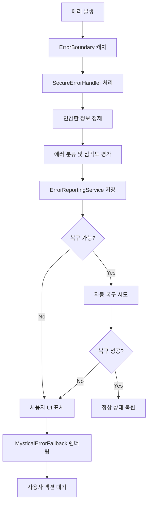

# 🛡️ Enhanced Error Boundary System

종합적인 보안 강화 에러 바운더리 시스템 - 타로 타이머 앱을 위한 신비로운 테마의 안전한 에러 처리 솔루션

## 📋 시스템 개요

이 에러 바운더리 시스템은 React 애플리케이션에서 발생하는 모든 에러를 안전하게 처리하고, 사용자에게 친화적인 복구 옵션을 제공합니다.

### 🎯 핵심 기능

- **🔒 보안 최우선**: 민감한 정보 자동 정제 및 redaction
- **🎨 신비로운 UI**: 타로 앱 테마에 맞는 애니메이션 에러 화면
- **🔄 자동 복구**: 다중 전략 기반 자동 에러 복구
- **📊 종합 분석**: 실시간 에러 분석 및 트렌드 모니터링
- **💾 로컬 우선**: 오프라인 환경에서도 작동하는 로컬 스토리지
- **🌐 다국어 지원**: 한국어 기반 사용자 친화적 메시지

## 🏗️ 아키텍처

### 핵심 컴포넌트

```
ErrorBoundary System
├── 🛡️ EnhancedErrorBoundary (메인 컴포넌트)
├── 🔒 SecureErrorHandler (보안 처리)
├── 📊 ErrorReportingService (리포팅)
├── 🔄 useErrorRecovery (복구 Hook)
└── 🎨 MysticalErrorFallback (UI 컴포넌트)
```

### 데이터 흐름



## 🚀 사용법

### 기본 사용

```tsx
import { EnhancedErrorBoundary } from '@/components/ErrorBoundary.enhanced';

function App() {
  return (
    <EnhancedErrorBoundary
      enableSecureHandling={true}
      enableMysticalUI={true}
      autoRecover={true}
      maxRetries={3}
    >
      <YourAppContent />
    </EnhancedErrorBoundary>
  );
}
```

### 고급 설정

```tsx
<EnhancedErrorBoundary
  // 보안 설정
  enableSecureHandling={true}
  reportingEnabled={true}
  
  // UI 설정
  enableMysticalUI={true}
  fallback={<CustomErrorUI />}
  
  // 복구 설정
  autoRecover={true}
  maxRetries={3}
  
  // 이벤트 핸들러
  onError={(error, errorInfo) => {
    console.log('Custom error handler:', error);
  }}
>
  <App />
</EnhancedErrorBoundary>
```

### Hook 사용

```tsx
import { useErrorRecovery } from '@/hooks/useErrorRecovery';

function ComponentWithRecovery() {
  const {
    attemptRecovery,
    manualRecovery,
    isRecovering,
    recoveryHistory,
  } = useErrorRecovery({
    enableAutoRecovery: true,
    maxRecoveryAttempts: 3,
    notifyUser: true,
  });

  const handleError = async (error: Error) => {
    const success = await attemptRecovery(error);
    if (!success) {
      await manualRecovery('session_refresh');
    }
  };

  return (
    <div>
      {isRecovering && <div>복구 중...</div>}
      <button onClick={() => handleError(new Error('Test'))}>
        Test Error
      </button>
    </div>
  );
}
```

## 🔧 구성 옵션

### EnhancedErrorBoundary Props

| Prop | Type | Default | 설명 |
|------|------|---------|------|
| `enableSecureHandling` | `boolean` | `false` | 보안 에러 처리 활성화 |
| `enableMysticalUI` | `boolean` | `false` | 신비로운 테마 UI 사용 |
| `autoRecover` | `boolean` | `false` | 자동 복구 활성화 |
| `maxRetries` | `number` | `3` | 최대 재시도 횟수 |
| `reportingEnabled` | `boolean` | `true` | 에러 리포팅 활성화 |
| `fallback` | `ReactNode` | `null` | 커스텀 폴백 UI |
| `onError` | `function` | `undefined` | 커스텀 에러 핸들러 |

### useErrorRecovery Options

| Option | Type | Default | 설명 |
|--------|------|---------|------|
| `enableAutoRecovery` | `boolean` | `true` | 자동 복구 활성화 |
| `recoveryTimeout` | `number` | `5000` | 복구 타임아웃 (ms) |
| `maxRecoveryAttempts` | `number` | `3` | 최대 복구 시도 횟수 |
| `notifyUser` | `boolean` | `true` | 사용자 알림 표시 |
| `preserveUserData` | `boolean` | `true` | 사용자 데이터 보존 |

## 🔒 보안 기능

### 민감한 정보 자동 정제

시스템이 자동으로 감지하고 제거하는 민감한 정보:

- **이메일 주소**: `john@example.com` → `[EMAIL_REDACTED]`
- **전화번호**: `+1-555-123-4567` → `[PHONE_REDACTED]`
- **IP 주소**: `192.168.1.100` → `[IP_REDACTED]`
- **JWT 토큰**: `eyJhbGciOi...` → `[TOKEN_REDACTED]`
- **파일 경로**: `/Users/john/secret.txt` → `[PATH_REDACTED]`
- **사용자 ID**: `user123` → `[USER_REDACTED]`

### 에러 분류 시스템

| 에러 타입 | 기본 심각도 | 복구 가능성 | 설명 |
|-----------|-------------|-------------|------|
| `network` | `medium` | ✅ | 네트워크 연결 문제 |
| `security` | `high` | ❌ | 보안 관련 에러 |
| `validation` | `low` | ✅ | 입력 검증 에러 |
| `runtime` | `medium` | ✅ | 런타임 에러 |
| `unknown` | `low` | ✅ | 분류되지 않은 에러 |

## 🎨 신비로운 UI

### 에러 타입별 테마

각 에러 타입에 따라 다른 신비로운 메시지와 아이콘을 표시:

| 타입 | 아이콘 | 제목 | 설명 |
|------|--------|------|------|
| Network | 🌐 | 연결의 실이 끊어졌습니다 | 신비로운 에너지의 흐름이 방해받고 있습니다 |
| Runtime | 🔮 | 예상치 못한 신비한 현상 | 카드들이 예기치 못한 움직임을 보이고 있습니다 |
| Validation | ⚠️ | 입력된 에너지가 불안정합니다 | 제공된 정보에 문제가 있습니다 |
| Security | 🛡️ | 보호막이 활성화되었습니다 | 안전을 위해 접근이 제한되었습니다 |

### 애니메이션 효과

- **입장 애니메이션**: 부드러운 페이드인 및 스케일 효과
- **파티클 시스템**: 신비로운 황금색 파티클이 배경에 떠다님
- **인터랙티브 요소**: 호버 효과와 버튼 애니메이션

## 🔄 복구 시스템

### 복구 전략 (우선순위순)

1. **컨텍스트 초기화** - 앱 상태를 안전한 초기값으로 재설정
2. **세션 갱신** - 현재 사용자 세션을 새로고침
3. **데이터 동기화** - 로컬 데이터를 서버와 재동기화
4. **캐시 정리** - 손상된 캐시를 정리하고 필수 데이터 재로드
5. **컴포넌트 재마운트** - 문제 컴포넌트를 강제 재마운트
6. **앱 재시작** - 최후의 수단으로 전체 앱 재시작

### 자동 복구 프로세스

```typescript
// 자동 복구 흐름
const recovery = async (error: Error) => {
  1. 에러 타입 분석
  2. 적합한 복구 전략 선택
  3. 사용자 알림 (선택적)
  4. 복구 전략 실행
  5. 결과 검증
  6. 성공 시: 상태 복원 + 성공 알림
  7. 실패 시: 다음 전략 시도 또는 수동 옵션 제공
};
```

## 📊 분석 및 리포팅

### 에러 분석 데이터

시스템이 자동으로 수집하고 분석하는 데이터:

- **에러 발생 빈도**: 시간별, 일별 에러 트렌드
- **에러 타입 분포**: 네트워크, 런타임, 보안 등 카테고리별 분석
- **심각도 분포**: Critical, High, Medium, Low 레벨별 분석
- **복구 성공률**: 자동/수동 복구 시도의 성공률 통계
- **영향받은 사용자**: 익명화된 사용자 수 집계
- **상위 에러**: 가장 빈번한 에러들의 순위

### 스토리지 전략

```typescript
// 로컬 스토리지 구조
{
  "@tarot_timer_error_reports": [
    {
      id: "rpt_timestamp_random",
      error: SanitizedError,
      deviceInfo: DeviceInfo,
      appInfo: AppInfo,
      userContext: UserContext,
      recovery?: RecoveryAttempt,
      localOnly: boolean
    }
  ],
  "@tarot_timer_error_analytics": {
    totalErrors: number,
    errorsByType: Record<string, number>,
    errorsBySeverity: Record<string, number>,
    recoveryRate: number,
    generatedAt: number
  }
}
```

## 🧪 테스트

### 테스트 커버리지

- ✅ **Unit Tests**: 개별 컴포넌트 및 서비스 테스트
- ✅ **Integration Tests**: 전체 시스템 통합 테스트
- ✅ **Security Tests**: 민감한 정보 정제 검증
- ✅ **Recovery Tests**: 복구 시스템 동작 검증
- ✅ **UI Tests**: 신비로운 테마 UI 렌더링 테스트

### 테스트 실행

```bash
# 전체 테스트 수트 실행
node src/scripts/test-error-boundary.js

# 개별 테스트 실행
npm test src/components/__tests__/ErrorBoundary.test.tsx
npm test src/lib/errorHandling/__tests__/SecureErrorHandler.test.ts
npm test src/lib/errorHandling/__tests__/ErrorReportingService.test.ts
npm test src/hooks/__tests__/useErrorRecovery.test.ts
npm test src/components/__tests__/ErrorBoundary.integration.test.tsx

# 커버리지 리포트 생성
npm test -- --coverage
```

## 📱 플랫폼 지원

- ✅ **React Native**: iOS, Android 네이티브 앱
- ✅ **React Web**: 모던 웹 브라우저
- ✅ **Expo**: Expo 개발 환경
- ✅ **TypeScript**: 완전한 타입 안전성

## 🔧 설정 및 커스터마이제이션

### 테마 커스터마이제이션

```tsx
// 커스텀 테마 적용
const customTheme = {
  colors: {
    premiumGold: '#FFD700',
    mysticalPurple: '#9932CC',
    // ... 기타 색상
  },
  animations: {
    particleSpeed: 2000,
    fadeInDuration: 800,
    // ... 기타 애니메이션 설정
  }
};
```

### 메시지 커스터마이제이션

```tsx
// 커스텀 에러 메시지
const customMessages = {
  network: {
    title: '인터넷 연결이 불안정합니다',
    description: '네트워크 상태를 확인해주세요',
    icon: '📡',
  },
  // ... 기타 메시지
};
```

## 🚨 문제 해결

### 일반적인 문제

1. **AsyncStorage 에러**
   ```bash
   Error: AsyncStorage is not available
   ```
   해결: React Native에서 `@react-native-async-storage/async-storage` 설치 필요

2. **애니메이션 성능 문제**
   ```tsx
   // useNativeDriver: true 설정
   Animated.timing(value, {
     toValue: 1,
     useNativeDriver: true, // 추가
   })
   ```

3. **타입 에러**
   ```bash
   Property 'children' does not exist on type
   ```
   해결: React 18+ 에서는 `React.FC`의 children이 암시적이지 않음

### 성능 최적화

- **메모이제이션**: React.memo, useMemo, useCallback 활용
- **지연 로딩**: 에러 UI 컴포넌트의 지연 로딩
- **스토리지 최적화**: 오래된 에러 리포트 자동 정리
- **애니메이션 최적화**: Native driver 사용으로 60fps 유지

## 📚 관련 문서

- [React Error Boundaries](https://reactjs.org/docs/error-boundaries.html)
- [React Native AsyncStorage](https://react-native-async-storage.github.io/async-storage/)
- [Jest Testing Framework](https://jestjs.io/)
- [React Native Testing Library](https://callstack.github.io/react-native-testing-library/)

## 🤝 기여하기

1. 이슈 리포팅은 GitHub Issues 사용
2. Pull Request는 develop 브랜치로 제출
3. 모든 변경사항에 대해 테스트 작성 필수
4. 코드 스타일은 ESLint 설정 준수

## 📄 라이센스

MIT License - 자유롭게 사용, 수정, 배포 가능

---

*🔮 "모든 에러는 새로운 지혜로 이어지는 길입니다" - 타로 타이머 개발팀*